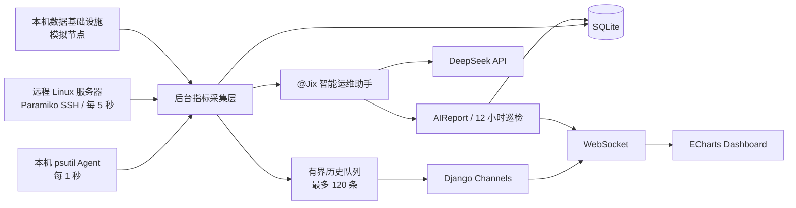

# Flink-Agent 智能服务器性能分析与 DeepSeek AI 运维平台

> 基于 Django、WebSocket 与 DeepSeek 的服务器集群实时监控和智能运维平台。

Flink-Agent 面向大数据平台运维场景，实时采集本机及远程 Linux 服务器的 CPU、内存、磁盘、网络和进程指标，通过 WebSocket 推送到 ECharts Dashboard，并由智能运维助手 **@Jix** 提供干预提醒、故障分析和优化建议。

系统健康时，@Jix 保持静默值守；只有检测到需要人工干预的资源风险、状态恢复或定期巡检发现优化项时，才会主动推送消息。

## 项目特性

- 本机 Agent 每秒采集 CPU、内存、磁盘、I/O、网络和进程数据
- 独立后台线程运行，不阻塞 Django 请求线程
- 基于 Channels 与 Daphne 的 WebSocket 实时推送
- ECharts 最近 60 秒 CPU、内存、网络趋势图
- CPU 与内存占用最高的进程 TOP 10
- 服务器集群配置、切换、连接测试和远程 SSH 采集
- SSH 密码后端加密存储，API 不返回敏感字段
- @Jix 对话式运维问答和本地降级诊断
- DeepSeek Chat Completions 智能分析
- 每 12 小时自动巡检，可在页面立即触发巡检
- AIReport 巡检报告持久化
- 本机大数据基础设施模拟集群视图
- 有界历史队列和降频进程扫描，避免页面与服务端卡顿

## 系统架构



## 技术栈

| 分类 | 技术 |
| --- | --- |
| 后端 | Python 3.9、Django 4.2、Django REST Framework |
| 实时通信 | Django Channels、Daphne、WebSocket |
| 指标采集 | psutil、threading |
| 远程监控 | Paramiko、SSH |
| AI | DeepSeek Chat Completions API |
| 前端 | HTML、CSS、JavaScript、ECharts |
| 数据库 | SQLite |
| 安全 | Fernet 对称加密、环境变量、API 敏感字段隔离 |

## 功能说明

### 本机实时监控

本机 Agent 默认每秒采集一次：

- CPU 使用率、逻辑核心数、当前频率
- 内存总量、已使用量、使用率
- 磁盘总量、已使用量、使用率、读写速率
- 网络下载和上传速率
- CPU 占用最高进程 TOP 10
- 内存占用最高进程 TOP 10

进程列表每 5 秒更新一次，减少高频遍历系统进程带来的额外负载。

### 服务器集群

Dashboard 顶部支持添加和切换服务器。远程服务器配置包含：

- 名称
- IP 地址
- SSH 端口
- 用户名
- 密码
- 节点说明

远程 Agent 使用 SSH 执行 Linux 系统命令，获取 CPU、内存、磁盘、网络和进程指标。多个远程节点由后台采集管理器并发处理，不会阻塞 Web 请求。

### @Jix 智能运维助手

@Jix 接收当前服务器指标、服务器集群状态和数据基础设施上下文，可用于回答：

- 当前服务器是否需要干预？
- 哪个资源存在风险？
- Kafka、Redis 或 MySQL 当前是否异常？
- Flink 任务或服务器应该如何优化？
- 当前项目代码有哪些可改进项？

主动提醒策略：

1. 健康状态下保持静默。
2. CPU、内存或磁盘进入关注/告警区间时推送干预提醒。
3. 指标恢复后推送恢复信息。
4. 每 12 小时进行一次服务器和项目代码巡检。
5. 巡检发现优化项时，通过 WebSocket 推送给 Dashboard。

DeepSeek 不可用或没有配置密钥时，系统会自动使用本地规则返回基于实时指标的降级回答。

### 数据基础设施视图

本机未运行真实数据集群时，系统提供以下明确标记为 `SIMULATED` 的节点：

- Kafka
- Redis
- MySQL
- Flink
- HDFS
- YARN
- ZooKeeper
- Elasticsearch

模拟节点展示节点角色、CPU、内存、网络和中间件关键指标，用于演示集群态势。它们不是生产数据，不会伪装成真实采集结果。

| 数据类型 | 当前来源 | 状态 |
| --- | --- | --- |
| 本机系统指标 | psutil | 真实数据 |
| 远程 Linux 系统指标 | Paramiko SSH | 真实数据 |
| 本机 Kafka/Redis/MySQL 等节点 | 内置模拟器 | 模拟数据，页面明确标识 |
| Flink REST 指标 | `flink_monitor.py` 预留 | 待完善 |
| 中间件 JMX/Exporter 指标 | 采集器接口预留 | 待完善 |

## 快速开始

### 1. 获取项目

```bash
git clone <your-repository-url>
cd flinkAgentDjango
```

如果直接使用当前项目目录：

```powershell
cd E:\pythonProgram\flinkAgentDjango
```

### 2. 安装依赖

建议使用 Python 3.9：

```bash
python -m pip install -r requirements.txt
```

项目已经固定 Windows Python 3.9 所需的兼容依赖版本，避免 Daphne、Paramiko 的加密组件出现 DLL 加载错误。

### 3. 初始化数据库

```bash
python manage.py migrate
```

迁移过程会自动创建一个“本机节点”。

### 4. 配置 DeepSeek

复制配置模板：

```powershell
Copy-Item .env.example .env
```

Linux/macOS：

```bash
cp .env.example .env
```

编辑 `.env`：

```env
DEEPSEEK_API_KEY=your_deepseek_api_key
DEEPSEEK_MODEL=deepseek-v4-flash
JIX_INSPECTION_INTERVAL=43200
```

`.env` 已加入 `.gitignore`，不要将真实 API Key 提交到 GitHub。

也可以直接使用系统环境变量：

```powershell
$env:DEEPSEEK_API_KEY="your_deepseek_api_key"
python manage.py runserver
```

### 5. 启动项目

```bash
python manage.py runserver
```

访问：

```text
http://127.0.0.1:8000/
```

Daphne 会同时提供 Django HTTP 服务和 WebSocket 服务。

## 远程服务器接入

1. 打开 Dashboard。
2. 点击顶部“管理服务器”。
3. 输入服务器名称、IP、SSH 端口、用户名和密码。
4. 保存后点击“测试”。
5. SSH 连接成功后，从顶部服务器下拉框切换监控节点。

远程节点需满足：

- Linux 系统
- SSH 服务可用
- 账号可以执行 `top`、`free`、`df`、`cat /proc/net/dev` 和 `ps`
- 运行 Flink-Agent 的机器可以访问远程 SSH 端口

## 配置项

| 环境变量 | 默认值 | 说明 |
| --- | --- | --- |
| `DEEPSEEK_API_KEY` | 空 | DeepSeek API 密钥 |
| `DEEPSEEK_API_URL` | `https://api.deepseek.com/chat/completions` | DeepSeek Chat API 地址 |
| `DEEPSEEK_MODEL` | `deepseek-v4-flash` | DeepSeek 模型名称 |
| `JIX_INSPECTION_INTERVAL` | `43200` | 自动巡检周期，单位为秒 |

Django 本机采集配置位于 `config/settings.py`：

| 配置 | 默认值 | 说明 |
| --- | --- | --- |
| `AGENT_COLLECT_INTERVAL` | `1.0` | 本机采集周期，单位为秒 |
| `AGENT_HISTORY_LIMIT` | `120` | 后台历史队列最大长度 |

## API 概览

| 方法 | 地址 | 说明 |
| --- | --- | --- |
| `GET` | `/api/servers/` | 获取服务器列表 |
| `POST` | `/api/servers/` | 添加远程服务器 |
| `PUT/PATCH` | `/api/servers/{id}/` | 更新服务器配置 |
| `DELETE` | `/api/servers/{id}/` | 删除远程服务器 |
| `POST` | `/api/servers/{id}/test_connection/` | 测试 SSH 连接 |
| `GET` | `/api/servers/{id}/snapshot/` | 获取单次服务器快照 |
| `GET` | `/api/reports/` | 获取最近巡检报告 |
| `POST` | `/api/jix/chat/` | 向 @Jix 提问 |
| `POST` | `/api/jix/inspect/` | 立即执行一次智能巡检 |

WebSocket：

| 地址 | 说明 |
| --- | --- |
| `/ws/metrics/` | 本机实时指标 |
| `/ws/metrics/{server_id}/` | 远程服务器实时指标 |

## 数据模型

### Server

保存本机和远程服务器信息、连接状态及加密后的 SSH 凭据。

### MetricRecord

保存服务器历史指标。远程采集器按分钟降采样写入，避免 SQLite 数据量无界增长。

### AIReport

保存 @Jix 巡检时间、服务器、风险等级、问题、影响和优化建议。

## 项目结构

```text
flinkAgentDjango/
├── manage.py
├── config/                       # Django 配置、URL、ASGI/WSGI
├── agent/
│   ├── collector.py              # 本机 psutil 采集器
│   ├── cluster_collector.py      # 远程集群后台采集管理器
│   ├── remote_monitor.py         # Paramiko SSH 采集
│   ├── cluster_simulator.py      # 本机数据基础设施模拟节点
│   ├── server_monitor.py
│   └── flink_monitor.py          # Flink REST 模块预留
├── dashboard/
│   ├── consumers.py              # WebSocket Consumer
│   ├── routing.py
│   ├── views.py
│   ├── urls.py
│   ├── tests.py
│   └── templates/dashboard/
├── ai_analysis/
│   ├── deepseek.py               # DeepSeek API 客户端
│   ├── analyzer.py               # 上下文、问答和巡检分析
│   ├── scheduler.py              # 12 小时巡检调度器
│   ├── views.py
│   └── urls.py
├── monitoring/
│   ├── models.py                 # Server、MetricRecord、AIReport
│   ├── fields.py                 # 加密字段
│   ├── serializers.py
│   ├── views.py
│   └── migrations/
├── static/dashboard/             # Dashboard CSS 与 JavaScript
├── requirements.txt
├── .env.example
└── README.md
```

## 测试

运行全部自动化测试：

```bash
python manage.py test --verbosity 2
```

当前测试覆盖：

- Dashboard 页面访问
- 本机指标标准化
- 模拟数据基础设施节点
- WebSocket 指标推送
- 服务器配置接口
- SSH 密码加密和 API 敏感字段隔离
- @Jix 问答接口
- 手动巡检接口

## 安全说明

- 禁止将 DeepSeek API Key 或服务器密码写入源码。
- `.env`、SQLite 数据库和本地 IDE 文件不应提交到仓库。
- SSH 密码使用基于 Django `SECRET_KEY` 派生的 Fernet 密钥加密。
- 修改生产环境 `SECRET_KEY` 前，应先制定 SSH 凭据迁移方案。
- 当前开发模式会自动接受首次出现的 SSH Host Key；生产环境应维护并校验 `known_hosts`。
- 生产环境应关闭 `DEBUG`，设置强随机 `SECRET_KEY`、严格 `ALLOWED_HOSTS`，并使用 Redis Channel Layer。
- 建议在反向代理层启用 HTTPS/WSS、身份认证、访问控制和请求限流。

## 性能设计

- 采集线程与 Web 请求线程分离
- 远程服务器并发采集
- WebSocket 增量推送，不轮询整页
- 前端趋势数据限制为最近 60 个点
- 后台历史队列限制为 120 条
- 进程扫描间隔为 5 秒
- 远程历史指标按分钟持久化
- ECharts 使用增量数据更新

## 开发路线图

- [x] Django Dashboard 与本机 CPU/内存采集
- [x] 磁盘、网络、I/O 和进程 TOP 10
- [x] WebSocket 实时数据流
- [x] 服务器集群管理与远程 SSH 系统采集
- [x] @Jix DeepSeek 问答与本地降级回答
- [x] 12 小时巡检与 AIReport
- [x] 八类本机数据基础设施模拟节点
- [ ] Flink REST API 完整指标与健康评分
- [ ] Kafka JMX 指标与 Consumer Lag 真实采集
- [ ] Redis INFO 指标采集
- [ ] MySQL Performance Schema 指标采集
- [ ] HDFS、YARN、ZooKeeper、Elasticsearch 真实指标采集
- [ ] Redis Channel Layer 与多实例部署
- [ ] 用户认证、权限管理和审计日志
- [ ] 告警通知渠道：邮件、Webhook、企业 IM

## 参与开发

欢迎通过 Issue 提交缺陷、功能建议或新的中间件采集器。提交代码前请先运行：

```bash
python manage.py check
python manage.py test
```

提交中请说明测试环境、复现步骤以及指标来源是真实数据还是模拟数据。
